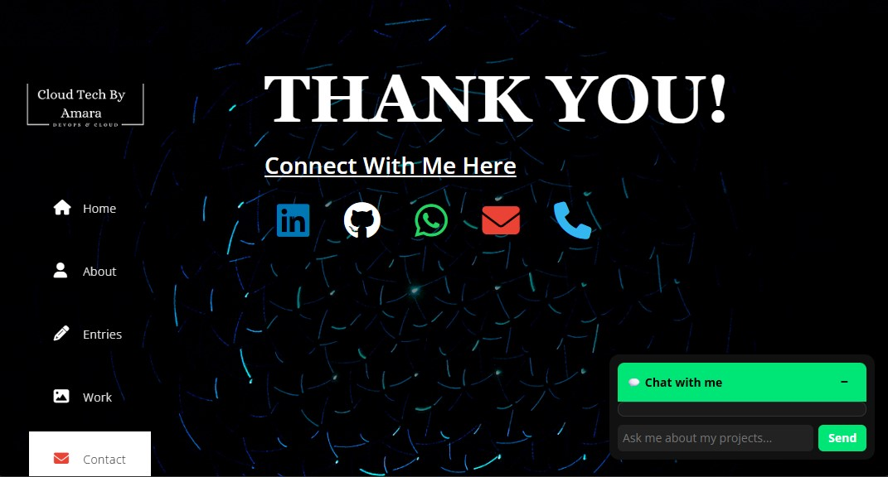
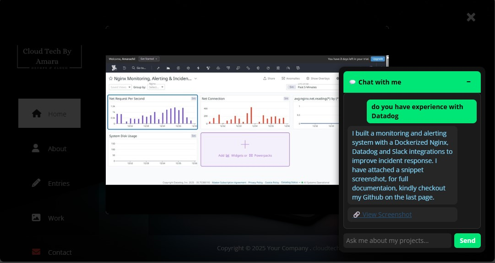
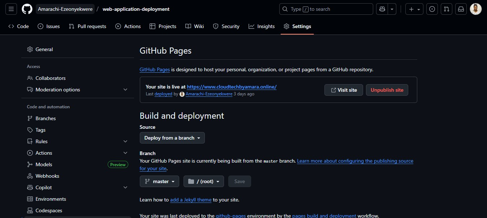

#  Cloud & DevOps Portfolio Website  

This project is my **personal portfolio website**, built to showcase **Cloud Engineering, DevOps, and Automation projects**.  
Beyond being a portfolio, the site is designed to **demonstrate how digital solutions can improve visibility, communication, and trust** in technical work.  

It is live on **GitHub Pages**, easy to maintain with Git, and acts as a **practical example of deploying, updating, and automating web applications** skills directly tied to real-world DevOps and cloud roles.  

---

##  Business & Real-World Relevance  

- **Problem: Recruiters and teams often struggle to quickly understand what a candidate can deliver.**  
  🔹 *Solution:* A **chatbot-driven portfolio** that provides instant, structured answers about my projects (e.g., monitoring, automation, cloud infra, linux).  
  → Demonstrates how automation improves **self-service information sharing** (a concept used in customer support portals and internal engineering knowledge bases).  

- **Problem: Stakeholders want proof of hands-on work, not just words.**  
  🔹 *Solution:* A **screenshot gallery** that visually documents project steps and results.  
  → Mirrors how engineering teams use **dashboards and evidence-based reporting** to communicate results in business.  

- **Problem: Updating technical content often requires complex pipelines.**  
  🔹 *Solution:* Deployed on **GitHub Pages**, where any code push automatically reflects online.  
  → Shows how Git-based workflows enable **continuous delivery of documentation and apps** with low overhead.  
 

---

##  Features  

- **Chatbot Assistant**  
  Helps visitors navigate projects and find information instantly.  
  Mimics **self-service support bots** used in SaaS and IT operations.  

- **Screenshot Gallery**  
  Provides transparent, step-by-step evidence of projects.  
  Similar to how **compliance and IT teams use evidence reports**.  

- **Responsive Design**  
  Works across devices—important for **user-facing apps**.  

- **GitHub Pages Deployment**  
  Zero-cost hosting with **built-in CI/CD pipeline** (Git push = live update).  


---

##  Setup & Deployment  

### 1. Clone the Repository  
```bash
git clone https://github.com/<your-username>/<your-repo>.git
cd <your-repo>
```

### 2. Run Locally

Open `index.html` in your browser.

### 3. Deploy on GitHub Pages

* Push changes:

  ```bash
  git add .
  git commit -m "Initial portfolio commit"
  git push origin main
  ```
* Go to **Settings → Pages → Select branch `main`**
* Site goes live at:
  `https://<your-username>.github.io/<your-repo>/`
* At this point you integrate a domain name from any DNS provider, add reacords and in few hours your url will be customised to your domain name.

---

##  Updating the Website

Every `git push` = automatic live update on GitHub Pages.
This mirrors how businesses use **continuous deployment** to ship features faster.

---

##  Demo Screenshots

Webpage-Front View


Webpage-Back View


AI Chatbot Integration


Git Page



---


##  License

For personal showcase purposes only.
You’re welcome to fork/adapt for your own learning journey.


##  Codebase Location
The main website code is stored in the **`master`** branch.  

[Click here to view the codebase](https://github.com/Amarachi-Ezeonyekwere/web-application-deployment/tree/master)

⚠️ Important: If you are forking this project to work with the code,  
please switch to the **`master` branch** `git checkout master`

 

This branch (`docs`) is for project documentation, explanations, and supporting files.


---

*Kindly note: This project is interative and ongoing,Thank you for reading!*